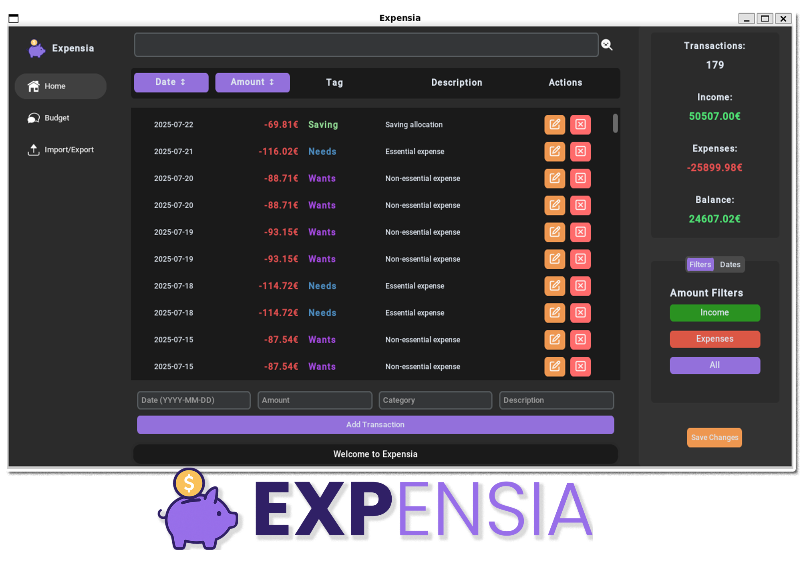
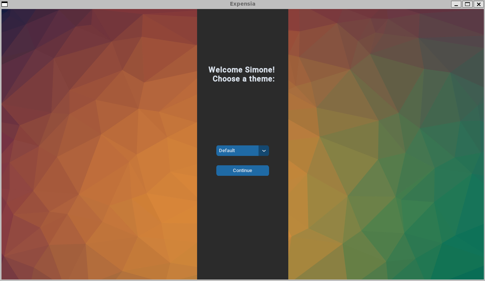
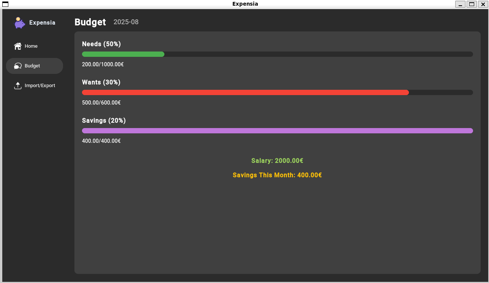
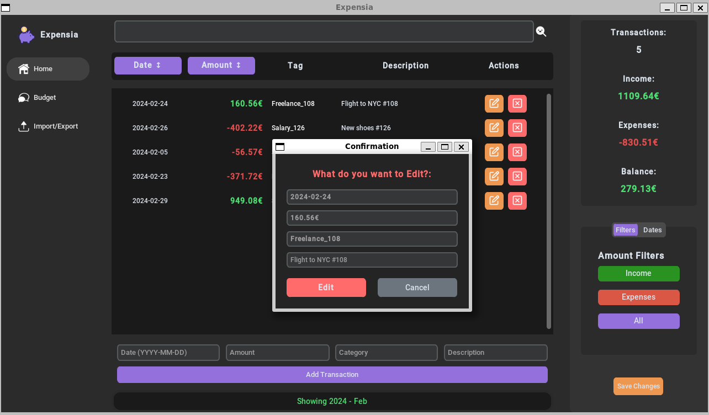

<p align="center">
  
</p>

# Expensia: A Personal Finance Management Application


## 📖 Project Overview

**Expensia** was created as a comprehensive project to enhance my development skills in a real-world environment. Over approximately **90 hours** of dedicated development time (tracked using time management tools), I focused extensively on refactoring and mastering Python's GUI frameworks, including Tkinter and its modern extension, CustomTkinter.

The refactoring process was primarily undertaken to achieve cleaner, more maintainable code while implementing proven design patterns for an overall superior project architecture. This endeavor rekindled my programming passion and reinforced the critical importance of thorough planning in application development. Even seemingly simple applications can encounter significant challenges without proper forethought. 

For a detailed development journey, please visit: **[Project Development Considerations](docs/development_path.md)**

While the application is fully functional, there's always room for improvement through additional testing and feature enhancements. However, I've decided to conclude this phase to explore other technologies and embark on new projects. Rest assured, any critical issues will be promptly addressed.

## 🛠️ Technologies Used

| Technology | Purpose |
|------------|---------|
| **Python** | Core programming language for application development |
| **SQLite3** | Lightweight, local database engine for secure data management |
| **CSV Processing** | Built-in module for seamless data import/export functionality |
| **CustomTkinter** | Modern, customizable GUI framework for enhanced user interface |
| **Tkinter** | Native Python GUI toolkit providing foundational components |
| **JSON** | Configuration file format for theme and customization settings |


## 📚 Comprehensive Documentation: A Good Project Starts with Its Documentation

While the application may not be perfect, I believe in thoroughly documenting every aspect of the development process. This documentation serves not only as a reference for the codebase but also chronicles the entire development journey, including challenges, design decisions, and key learnings that simulate a real-world development environment.

The documentation is structured to provide insights into both technical implementation and the development methodology, reflecting practices you'd encounter in professional software development.

#### 📖 **Documentation Structure**

1. **[Source Code Documentation](docs/Application_Documentation/documentation.md)**  
   *The foundation of the project* - Comprehensive explanation of all functions and methods, with detailed coverage of the more complex implementations and architectural decisions.

2. **[Grid Layout Documentation](docs/Application_Documentation/the_grid_layout.md)**  
   *Visual structure guide* - Detailed explanation of widget visualization and layout management using Tkinter and CustomTkinter's grid system for optimal user interface design.

3. **[Design Pattern - Observer - Documentation](docs/Application_Documentation/observer_pattern.md)**  
   *Architectural insights* - In-depth explanation of the Observer pattern implementation, serving as the primary communication mechanism between different application components.

4. **[Project Development Considerations](docs/development_path.md)**  
   *The journey chronicle* - Comprehensive coverage of development challenges, design choices, lessons learned, and insights on topics including AI assistance, refactoring strategies, and design principles.

5. **[User Guide](docs/user_guide.md)**  
   *Complete usage manual* - Step-by-step user guide covering every application feature and functionality, ensuring users can maximize their experience with Expensia.


# ✨ What Can You Do with Expensia?

<p align="center">
  
  <br>
  <em>Live preview of the application in action</em>
</p>

Expensia is a robust personal finance management application built in Python that empowers you to track expenses efficiently while providing powerful filtering capabilities and intelligent budget management through customizable budgeting rules.

## 🚀 Key Features


- **Create, Edit & Delete**: Seamlessly manage your financial transactions with an intuitive interface
- **Real-time Updates**: Instant reflection of changes across the application
- **Multi-Parameter Filtering**: Filter data by year, date, amount, expense type, income, and month
- **Precise Data Visualization**: Get exactly the insights you need with granular control
- **SQLite Database**: Secure local storage with automatic backup functionality
- **CSV Import/Export**: 
  - Import transactions from CSV files with automatic database backup
  - Export your data to CSV format for external analysis
- **100% Local**: Complete data sovereignty with no cloud dependencies
- **50/30/20 Rule Implementation**:
  - **50%** for needs (essential expenses)
  - **30%** for wants (lifestyle expenses) 
  - **20%** for savings and debt repayment
- **Fully Customizable**: Adjust percentages to match your personal financial strategy
- **Visual Budget Tracking**: Clear overview of your spending patterns
- **Backup System**: Protect your financial data with built-in backup mechanisms
- **Local Storage**: Your data never leaves your device
- **Modern Desktop GUI**: Intuitive interface designed for seamless desktop interaction
- **Responsive Design**: Smooth performance across different screen sizes


---------

## 📊 Screenshots

<p align="center">
  <strong>Welcome View - Application Startup</strong><br>
  
  <br><br>
  
  <strong>Budget View - Financial Overview</strong><br>
  
  <br><br>
  
  <strong>Edit Functionality</strong><br>
  
  <br><br>
  
  <strong>Backup Management</strong><br>
  
</p>

---

## 🚀 Installation Guide

> **Note**: This application was developed and tested on WSL (Windows Subsystem for Linux) Ubuntu 22.04. While primarily designed for Linux environments, it should be compatible with Windows Python installations. Community contributions for broader platform support are welcome!

### Prerequisites

- **Python 3.7+** (recommended: Python 3.8 or higher)
- **pip** (Python package installer)

### 🐧 Linux Installation

1. **Clone the Repository**
   ```bash
   git clone git@github.com:MegumiSharp/Python-Finance-Manager.git
   cd Python-Finance-Manager
   ```

2. **Install Dependencies**
   ```bash
   pip install -r requirements.txt
   ```

3. **Launch Expensia**
   ```bash
   python3 main.py
   ```


## 🙏 Acknowledgements

We extend our gratitude to the following contributors and communities:

- **Python Community** - For creating and maintaining this versatile programming ecosystem
- **Tkinter Development Team** - For providing Python's foundational GUI library
- **[CustomTkinter](https://github.com/TomSchimansky/CustomTkinter)** - For modernizing Tkinter with beautiful, customizable components
- **[a13xe/CTkThemesPack](https://github.com/a13xe/CTkThemesPack)** - For providing an exceptional collection of themes that enhance CustomTkinter applications

---

