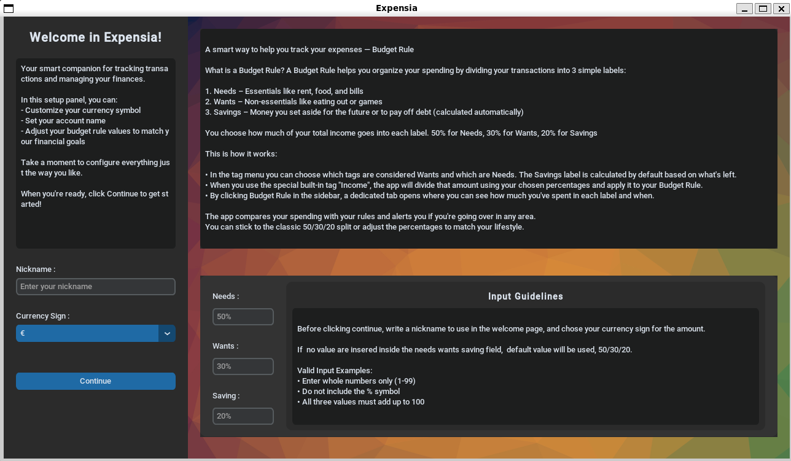
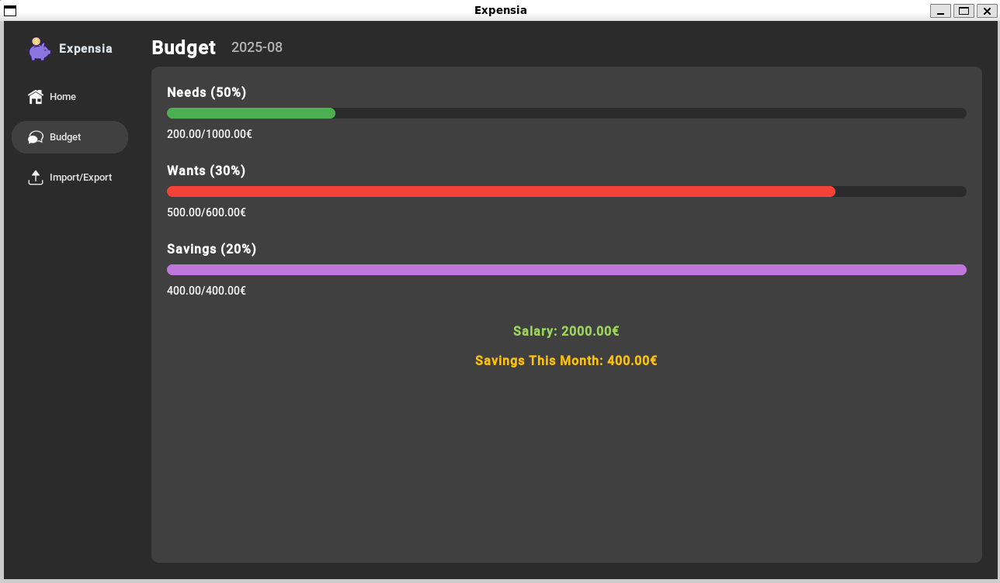
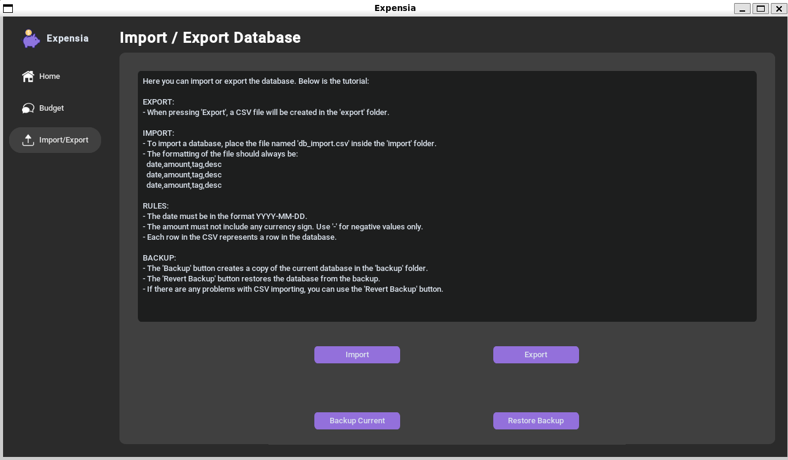
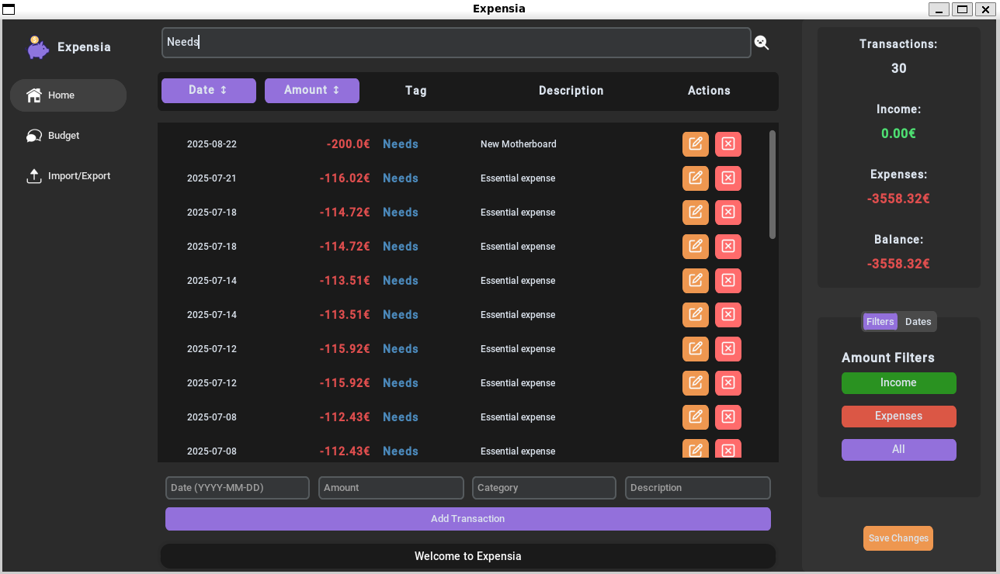
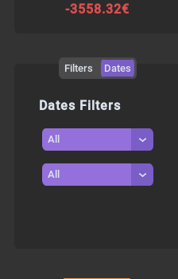
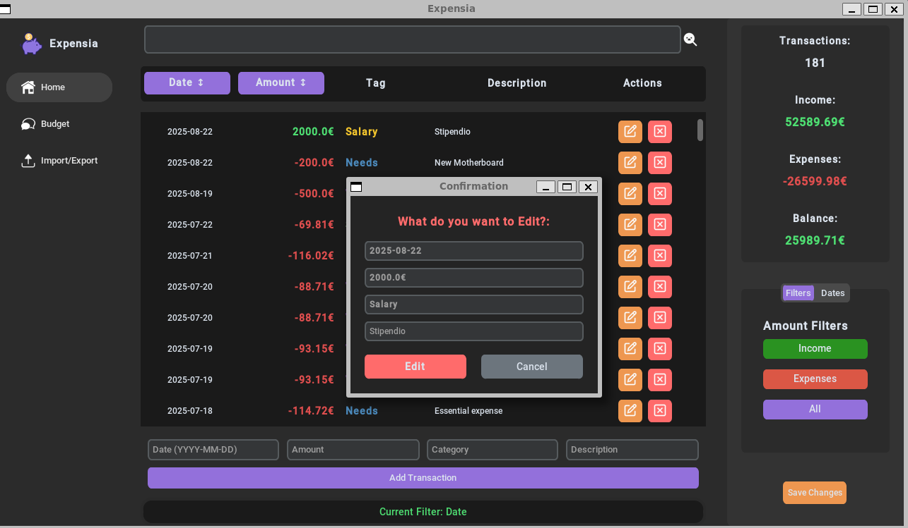

# Financial Management Application - User Guide

## Table of Contents
1. [Setup](#setup)
2. [Welcome View](#welcome-view)
3. [Dashboard](#dashboard)
4. [Budget Management](#budget-management)
5. [Import/Export](#importexport)
6. [Home - Transaction Management](#home---transaction-management)

---

## Setup

The setup screen appears only on the first launch of the application. However, settings can be modified later in the file located at `data/user_settings/user_settings.json`. To access the setup screen again, change the first entry from `"is_first_time": "false"` to `"is_first_time": "true"` and restart the application.

<p align="center">
  
  <br>
  <em>Preview of setup screen</em>
</p>


- **Nickname**: Used in the welcome screen (defaults to "User" if left empty)
- **Currency Symbol**: Displayed in the transaction table
- **Budget Percentages**: Used for the budget view calculations

Click **Continue** to use default values. All input limitations and requirements are displayed within the setup interface.

---

## Welcome View

This screen allows you to select the application theme. The chosen theme is automatically saved in `user_settings.json`. Use the dropdown menu to select a different theme, which will immediately take you to the main screen, or press **Continue** to use the last selected theme.

<p align="center">
  
  <br>
  <em>Preview of welcome view</em>
</p>

<p align="center">
  
  <br>
  <em>Preview of Default Theme</em>
</p>


<p align="center">
  
  <br>
  <em>Preview of NightTrain Theme</em>
</p>

<p align="center">
  
  <br>
  <em>Preview of Orange Theme</em>
</p>


<p align="center">
  
  <br>
  <em>Preview of SweetKind Theme</em>
</p>


---

## Dashboard

The Dashboard consists of:
- **Sidebar** (left): Navigation menu
- **Main Content Area** (right): Currently selected view

### Navigation Options:
- **Home** (default): Transaction management
- **Budget**: Budget tracking and analysis
- **Import/Export**: Data management tools

Clicking any navigation option updates the main content area to display the corresponding section.

---

## Budget Management

During setup, you specified three percentages that form the foundation of the budget rule. This is a financial management method that helps track your finances using special tags.

<p align="center">
  
  <br>
  <em>Preview of Budget view</em>
</p>


### The Budget Rule

For example, with a €2,000 monthly income:
- **50% for Needs**: Essential expenses (bills, food, utilities)
- **30% for Wants**: Non-essential purchases (entertainment, dining out, hobbies)
- **20% for Savings**: Emergency fund and future expenses

### Key Features:
- Percentages can be modified in `data/user_settings/user_settings.json` or during initial setup
- Budget displays current month data and resets monthly
- Savings bar fills automatically when salary is detected
- Real-time budget updates when transactions are saved

### Budget Tags (Case Sensitive):
- **"Salary"**: Monthly income (required for budget calculations)
- **"Needs"**: Essential expenses (deducted from needs budget)
- **"Wants"**: Non-essential expenses (deducted from wants budget)
- **"Saving"**: Savings transactions (deducted from savings budget)

### Budget Behavior:
- Overspending in needs or wants categories is automatically deducted from savings
- Unused funds from needs and wants become additional savings
- Budget resets on the 1st of each month
- Requires salary entry to activate monthly budget calculations

---

## Import/Export

This section provides crucial data management tools. **All operations require double-click confirmation** due to their importance.

<p align="center">
  
  <br>
  <em>Preview of Import and Export View</em>
</p>

### Import Function

Imports data from `import/db_import.csv`. The CSV format follows these rules:

#### CSV Format Example:
```
2024-03-15,880.04,Rent_42,Flight to NYC #42
2024-12-29,605.37,Health_43,Monthly rent #43
2024-05-12,325.55,Travel_48,Monthly rent #48
2024-04-18,572.72,Travel_49,Pharmacy visit #49
2024-03-31,1083.26,Rent_50,New shoes #50
```

#### Format Requirements:
- **Date**: YYYY-MM-DD format
- **Amount**: Use decimal point (.), not comma; no currency symbol; use "-" for negative amounts
- **Tag**: Category identifier
- **Description**: Transaction description
- **Structure**: Date,Amount,Tag,Description (no spaces after commas)
- Each transaction on a new line

**Important**: Import **replaces** the entire transaction table. To add multiple transactions, export current data, modify the CSV file, and re-import.

### Export Function

Creates `export/db_export.csv` containing all transactions in CSV format. This file can be modified externally and re-imported as needed.

### Backup Functions

#### Backup Current
- Creates a database backup in `backup/transactions_backup.db`
- Preserves complete transaction data in database format

#### Restore Backup
- Restores transactions from `backup/transactions_backup.db`
- Replaces current transaction table entirely

### Data Management Tips:
- Regular backups prevent data loss
- Export before major changes
- Import empty CSV to reset application data

---

## Home - Transaction Management

The core functionality of the application, allowing comprehensive financial transaction management.

### Search and Filter Features

#### Real-time Search Bar
- Located at the top of the interface
- Filters transactions as you type
- Use "+" to show only income transactions
- Use "-" to show only expense transactions

<p align="center">
  
  <br>
  <em>Preview of search bar in action</em>
</p>

#### Filter Buttons
- **Income**: Shows only positive transactions
- **Expenses**: Shows only negative transactions
- **All**: Displays all transactions

#### Date Filters
Access through the filters menu to display transactions by:
- **Year**: Shows all available years
- **Month**: Shows all months (including those without transactions)

<p align="center">
  
  <br>
  <em>Date filter options</em>
</p>

### Table Management

#### Sorting Options
- **Date Column**: Click to sort chronologically (ascending/descending)
- **Amount Column**: Click to sort by monetary value (highest/lowest)

#### Transaction Actions

##### Edit Transaction (Orange Pencil Icon)
- Opens popup window for transaction modification
- All transaction fields are editable
- Changes take effect immediately

<p align="center">
  
  <br>
  <em>Edit button pop up</em>
</p>

##### Delete Transaction (Red X Icon)
- Removes selected transaction
- Requires confirmation dialog
- Action cannot be undone

<p align="center">
  
  <br>
  <em>Delete button pop up</em>
</p>

### Adding New Transactions

Use the input fields at the bottom of the screen:
1. **Date**: Transaction date
2. **Amount**: Monetary value (positive for income, negative for expenses)
3. **Tag**: Category identifier
4. **Description**: Transaction details

Click **Add Transaction** to create the entry.

### Summary Sidebar

The right sidebar displays real-time statistics:
- **Total Transactions**: Number of visible transactions
- **Total Expenses**: Sum of negative transactions
- **Total Income**: Sum of positive transactions
- **Balance**: Net amount (Income - Expenses)

**Note**: Summary updates based on active filters.

### Save Changes

The **Save Changes** button (bottom right) is crucial for:
- Updating budget calculations
- Ensuring data persistence
- Preparing data for export/backup

**Important**: Changes are also automatically saved when closing the application.

---

## Tips for Effective Use

1. **Regular Backups**: Use the backup function frequently
2. **Consistent Tagging**: Use standard tags for better budget tracking
3. **Monthly Reviews**: Check budget performance at month-end
4. **Data Validation**: Verify imported data for accuracy
5. **Save Frequently**: Use "Save Changes" after significant modifications

---

## Troubleshooting

- **Import Errors**: Check CSV format and file location
- **Budget Not Updating**: Ensure "Salary" tag is used and "Save Changes" is clicked
- **Missing Transactions**: Verify correct filters are applied
- **Theme Issues**: Restart application if theme doesn't apply

---

*For additional support or questions about this application, refer to the settings file locations mentioned in this guide.*